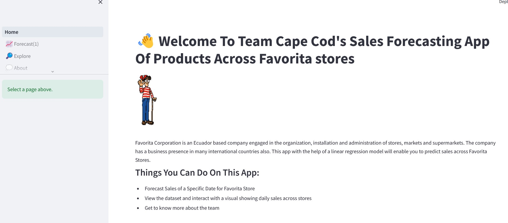
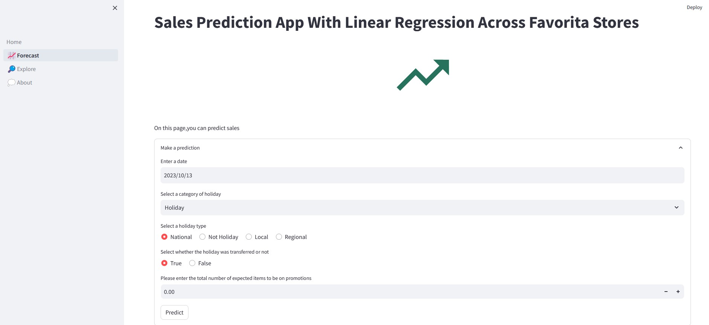
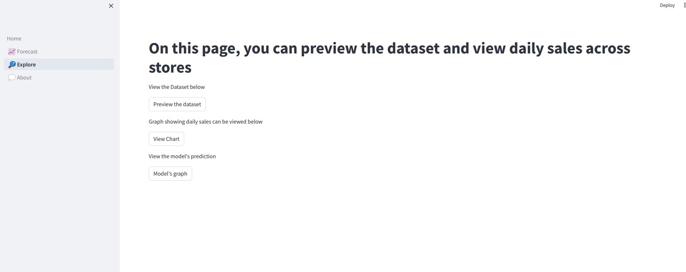

# Sales-Prediction-App-using-Linear-Regression-Model-LP4

## Table of Contents

1. [Introduction](#introduction)
2. [Project Objective](#project-objective)
3. [Project Goal](#project-goal)
4. [Reason for using Streamlit for Project](#reason-for-using-streamlit-for-project)
5. [Prerequisites](#prerequisites)
6. [Features Overview](#features-overview)
    - [Home Page](#home-page)
    - [Forecast Page](#forecast-page)
        - [Linear Regression Model](#linear-regression-model)
    - [Explore Page](#explore-page)
    - [About Page](#about-page)
7. [Project Summary](#project-summary)
8. [License](#license)
9. [Acknowledgments](#acknowledgments)
10. [Authors](#authors)
11. [Contact](#contact)

## Introduction

Facing the challenges posed by the competitive market, businesses are constantly on the lookout for innovative solutions that can elevate their operational efficiency to stay ahead. One common challenge confronted by retail enterprises is predicting future sales accurately. Leveraging the power of machine learning, Team Cape Cod embarked on a collaborative journey to develop a Sales Forecasting App, a predictive tool designed to assist businesses, specifically those within the retail sector, in anticipating sales patterns.

## Project Objective

The primary objective of our Sales Forecasting App, developed by Team Cape Cod, is to provide businesses, especially those in the retail sector, with a powerful tool for predicting future sales accurately. The project aims to address the challenges faced by organizations in anticipating consumer demand, enabling them to optimize inventory management, plan resources efficiently, and make strategic decisions based on reliable forecasts.

## Project Goal

The principal goal of the Sales Forecasting App is to empower businesses with a cutting-edge tool that enhances their strategic decision-making processes. The primary aim is to enable organizations, particularly those in the retail sector, to proactively predict future sales trends.

## Reason for using Streamlit for Project

We used Streamlit to develop the Sales Forecasting App due to its user-friendly interface, rapid prototyping capabilities, support for interactive data exploration, seamless integration with machine learning models, collaborative development features, a robust community, comprehensive documentation, and customization options for tailoring the app's appearance and behavior. These attributes collectively facilitated an efficient and successful development process.

## Prerequisites
Before running the Sales Prediction App, make sure you have the following prerequisites installed:
- [Streamlit](https://streamlit.io/)
- [Pandas](https://pandas.pydata.org/)
- [NumPy](https://numpy.org/)
- [Joblib](https://joblib.readthedocs.io/)
- [Scikit-learn](https://scikit-learn.org/stable/)
- [Plotly](https://plotly.com/)

Install the required libraries using the following command:

    ```bash
    pip install streamlit pandas numpy joblib scikit-learn plotly
    ```

## Features Overview

### Home Page

- **Purpose:** The Home Page serves as the central hub for the Sales Forecasting App, introducing users to its primary functionalities. It provides an overview of the app's purpose, offering a glimpse into the predictive capabilities for sales across Favorita stores. Additionally, the Home Page incorporates interactive elements, including buttons for navigation to specific pages like Forecast, Explore, and About. To enhance user engagement, the page features animations, such as a waving GIF, creating a visually appealing and dynamic interface.

- **Interface:**

  

### Forecast Page

- **Functionality:** The Forecast Page is designed to enable users to make predictions for sales across Favorita stores based on specified input parameters. Users can interact with the page by entering details such as the date, type of holiday, holiday locale, whether the holiday was transferred, and the expected number of items on promotion. Upon clicking the "Predict" button, the app utilizes a pre-trained machine learning model to forecast and display the total predicted sales for the given input. This page provides a practical and user-friendly interface for leveraging the predictive capabilities of the app to anticipate sales outcomes.

- **Interface:**

  

#### Linear Regression Model

  *How the Linear Regression Model Works*

The linear regression model in the Sales Forecasting App operates through a series of steps:

1. **Data Preparation:**
   - Historical sales data from Favorita stores is collected and prepared for model training.
   - Input parameters include the date, type of holiday, holiday locale, whether the holiday was transferred, and the expected number of items on promotion.
   
2. **Feature Engineering:**
   - Date features are extracted from the input date, encompassing year, month, day, day of the week, day of the year, week of the year, quarter, weekend indicator, and day of the month.
   - Categorical features undergo encoding using label encoding, binary encoding, and ordinal encoding to transform them into a format suitable for model training.

3. **Training the Model:**
   - The prepared and engineered data is utilized to train a linear regression model.
   - The model learns the relationships between the input features (such as date and holiday details) and the target variable (sales).

4. **Making Predictions:**
   - When a user inputs the required parameters on the Forecast page, the model applies the same feature engineering steps to the input data.
   - The trained linear regression model then predicts the total sales for the specified date and other input parameters.

5. **Displaying Predictions:**
   - The predicted sales are presented to the user on the Forecast page, offering insights into the expected sales outcome based on the provided inputs.
   - Users can leverage this information for planning and decision-making regarding inventory management, promotional strategies, and other aspects of their business.


### Explore Page

- **Data Exploration Features:** The Explore Page of the Sales Forecasting App is dedicated to data exploration, providing users with insightful visualizations and information about the dataset.

- **Dataset Preview:** Users have the option to preview the dataset, gaining a quick overview of its structure and content. This allows for a better understanding of the data before delving into visualizations.

- **Interactive Chart Display:** The page offers an interactive chart that visualizes daily sales across Favorita stores. Users can explore trends, patterns, and fluctuations in sales over time. This dynamic chart enhances the user experience by allowing for zooming, panning, and other interactive capabilities.

- **User-Triggered Chart Display:** Users can choose to view the chart by clicking a dedicated button. This interactive feature enables a more focused exploration, ensuring that users can access relevant visualizations when they desire.

- **Data Visualization with Plotly:** The app utilizes Plotly, a powerful data visualization library, to create engaging and informative charts. Plotly supports a variety of chart types, enhancing the depth and breadth of the data exploration experience.

- **Insights into Daily Sales:** By exploring the daily sales chart, users can glean insights into sales trends, seasonality, and potential influencing factors. This information can inform decision-making and help users better understand the dynamics of sales across different time periods.

- **Interface:**

  

### About Page

- **Introduce Team Cape Cod:** The About page in the Sales Forecasting App serves as a window into the collaborative effort of Team Cape Cod, the group behind the development of this innovative tool.

- **Team Members:** Meet the Team Cape Cod members and their respective contributions.

  1. **Kodwo Amissah-Mensah (Data Analyst):** A Data Analyst, Kodwo brings expertise in machine learning, Python, SQL, and data visualization to the team. His leadership has been pivotal in guiding the project towards success.

  2. **Regina Crabbe (Data Analyst):** Regina, a data analyst, Lecturer and PhD student enriches the team's analytical capabilities, contributing to the depth of the project.

  3. **Aliyyah Adebayo (Data Analyst):** As a computer science student and data analytics enthusiast, Aliyyah brings a passion for data-driven insights to the team. Her analytical skills and enthusiasm contributed to the project's vibrancy.

  4. **Alvin Momoh (Data Analyst):** Alvin, a Data Analytics Professional, infuses the team with a wealth of industry experience.

  5. **Leon Maina (Data Analyst):** Leon, with expertise in data analytics, also contributed in building the app. 

## Project Summary

|Code|Name of Project|Published Article|Deployed App|
|:---|:-------------:|:---------------:|-----------:|
|LP4 |Sales Prediction App |https://medium.com/@rndcrabbe/store-sales-analysis-using-time-series-forecasting-abb2ded07c8d|Medium|

## License

This project is licensed under the [MIT License](LICENSE).

## Acknowledgments

- Team members.
- Azubi Teachops


## Authors
- Regina Naa Dedei Crabbe
- Kodwo Amissah-Mensah
- Alvin Momoh
- Alliyah
- Leon

## Contact
Regina Naa Dedei Crabbe
- Email: rndcrabbe@gmail.com